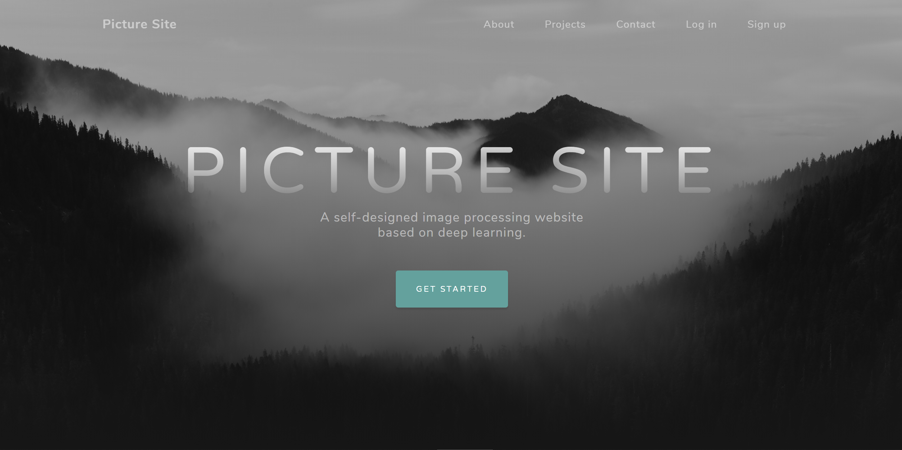
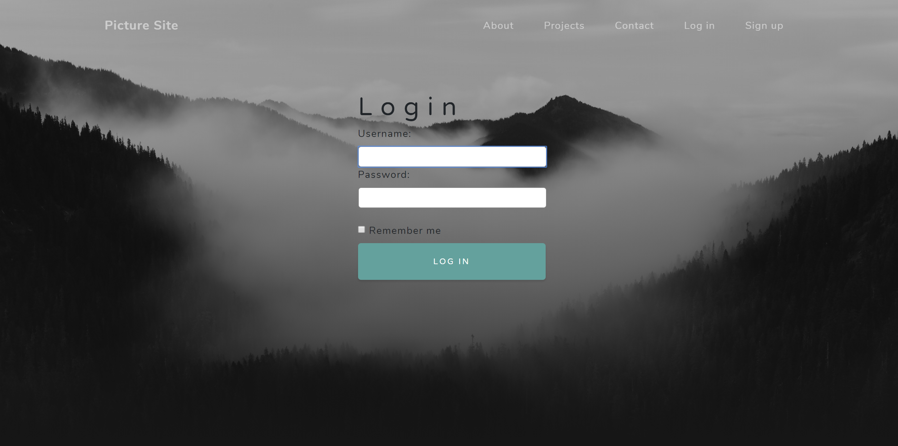
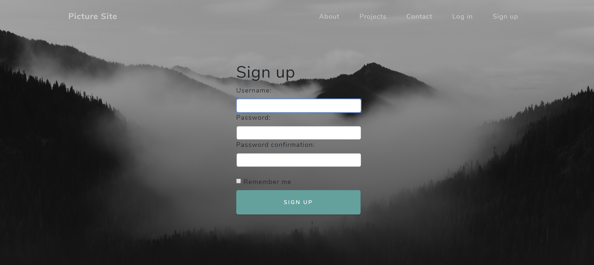
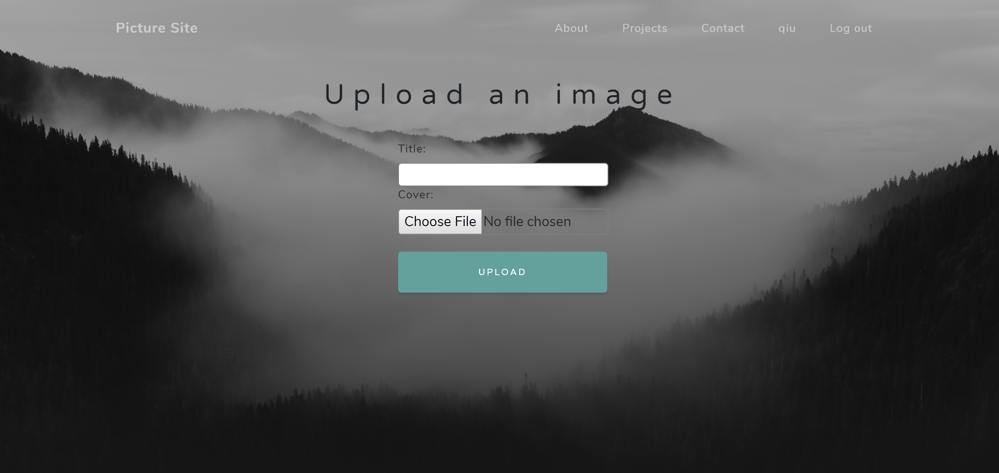
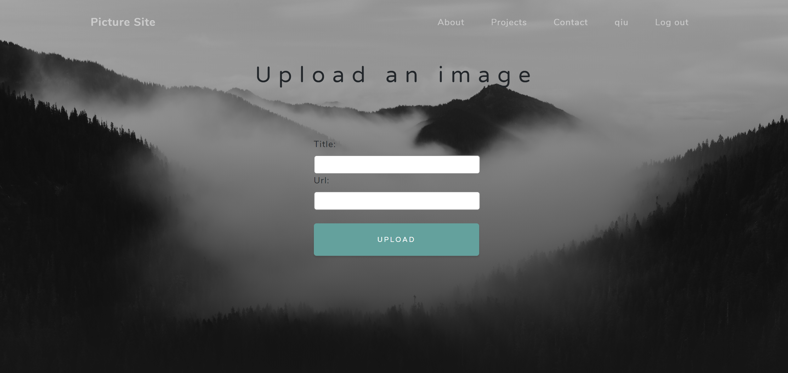
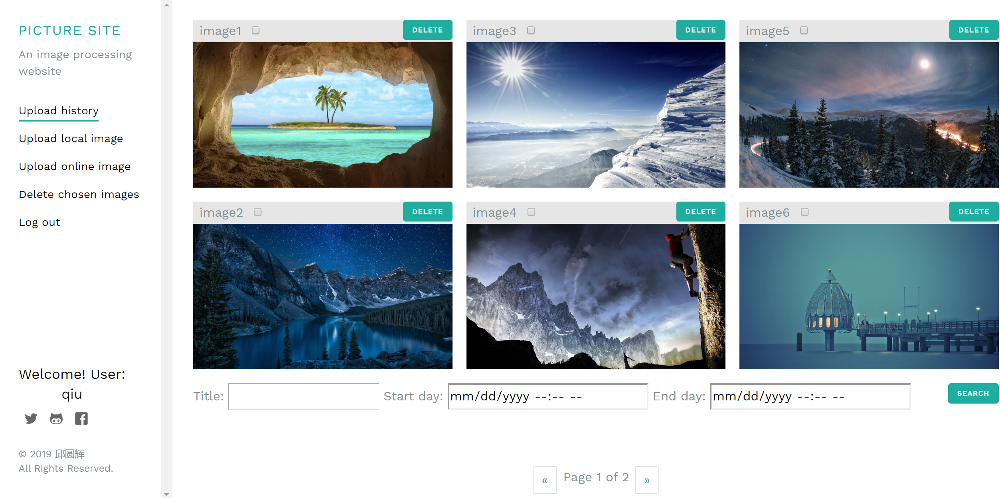
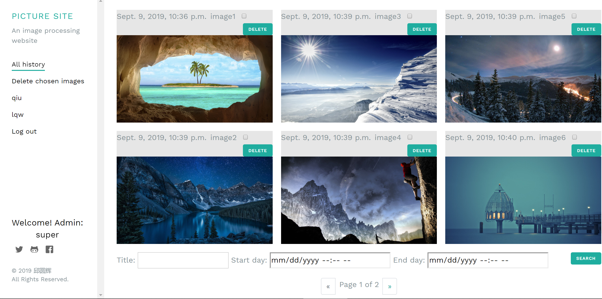
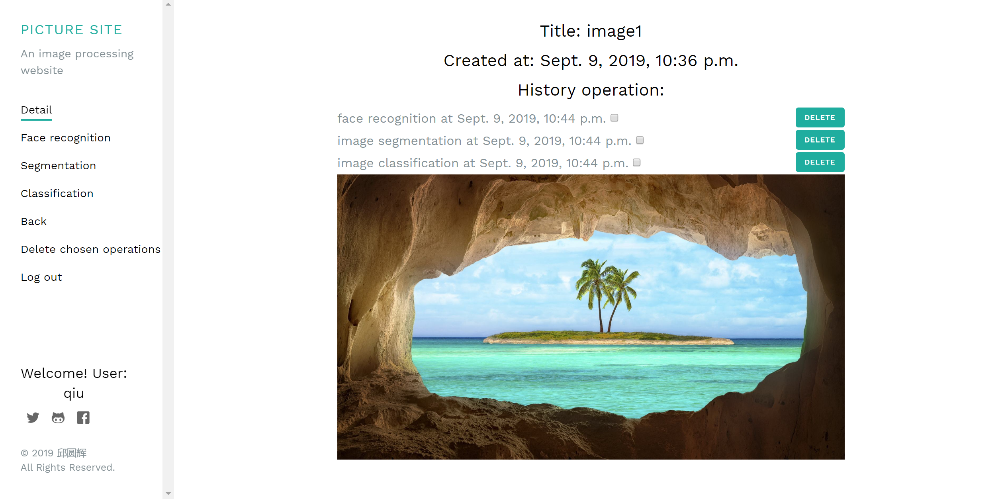

# report

> ##### 邱圆辉 	2017013591 https://github.com/Chinwer/PictureSite
>
> ##### 邓坤恬	2017013655

## 一、环境说明

- python==3.7.2

- django==2.2.4

## 二、部署方式

- ### 依赖库

  - tensorflow==1.14.0
  - Pillow==6.1.0
  - matplotlib==3.0.3
  - numpy==1.16.5
  - opencv-python==4.1.1.26
  - pandas==0.25.1
  - requests==2.21.0
  - torch==1.2.0+cpu
  - torchvision==0.4.0+cpu
  - facenet-pytorch==0.1.0

- ### 安装项目依赖

  在终端输入以下命令：

  ```bash
  pip install -r requirements.txt
  ```

- ### 运行方式

  在项目根目录下打开控制台，输入以下命令：

  ```bash
  python manage.py makemigrations
  python manage.py runserver
python manage.py migrate
  ```

  然后打开浏览器终端，访问 https://127.0.0.1:8000 即可自动跳转至项目主页
  
  

## 三、网页界面

- ### 项目主页

  

  - 左上角为项目名称：Picture Site。点击可跳转至主页。
  - 中心部分文字为项目logo及简介：基于深度学习的图片处理网页。
  - 中心部分按钮为开始导航按钮，点击可跳转至用户历史图片展示页面。
  - 右上角左起三个按钮为主页的导航按钮，点击可跳转至主页响应部分。
  - 右上角右起两个按钮分别为注册、登录按钮，点击可跳转至响应页面。

- ### 登录页面

  

  - 中心部分从上至下两个输入框分别为用户名、密码输入框。
  - 中心部分按钮为登录按钮，若用户名、密码正确，点击即可跳转至用户历史图片展示页面。
  - 其余部分同上。

- ### 注册页面

  

  - 中心部分从上至下三个输入框分别为用户名、密码、确认密码输入框。
  - 中心部分按钮为注册按钮，若用户名未被使用且密码合法，点击即可跳转至项目主页。
  - 其余部分同上。

- ### 上传本地图片页面

  

  - 中心部分从上至下两个输入框分别为图片标题输入框、图片文件选择框。
  - 中心部分按钮为上传按钮，若上传成功则跳转至用户历史图片展示页面。
  - 其余部分同上。

- ### 上传网络图片页面

  

  - 中心部分从上至下两个输入框分别为图片标题输入框、图片网络地址（URL）输入框。
  - 其余部分同上。

- ### 用户历史图片展示页面

  - 左上角logo为项目主页导航按钮，点击即可跳转至项目主页，下面文字为项目介绍。
  - logo下方从上至下依次为：
    - 本页导航链接，点击可刷新（回到）本页。
    - 上传本地图片链接，点击即可跳转至本地图片上传页面。
    - 上传网络图片链接，点击即可跳转至网络图片上传页面。
    - 批量删除图片按钮，点击即可批量删除历史图片。
    - 注销按钮，点击即可注销当前用户并跳转至项目主页。
  - 下方为欢迎文字，User代表当前登录的为普通用户，qiu代表用户名。
  - 文字下方依次为笔者twitter、github、facebook主页链接。
  - 右方展示了当前用户所有历史提交的图片，每个图片上方从左至右依次为：
    - 图片标题（名称）
    - 图片勾选框，选择后可通过“批量删除按钮”进行批量删除。
    - 删除按钮，点击即可删除单个图片。
  - 下方为筛选搜索框，从左至右依次为：
    - 标题筛选，搜索标题包含此筛选框内容的图片。
    - 开始日期，搜索提交日期晚于此日期的图片。
    - 结束日期，搜索提交日期早于此日期的图片。
  - 最下方为翻页按钮及显示当前页面索引的提示文字。

- ### 管理员浏览页面

  

  - 左方从上至下依次为：
    - 本页导航链接，点击可刷新（回到）本页。
    - 批量删除按钮，功能同上。
    - 所有用户导航链接，点击即可浏览对应用户的历史提交图片。如当前所有用户为qiu、lqw。
    - 最下方欢迎文字的Admin代表当前登录的为管理员账户，下方为账户名称。
  - 右方显示的为所有用户的历史提交图片。
  - 其余同上。

- ### 图片详情（处理）页面

  

  - 左边从上至下的链接依次为：

    - 图片详情链接，可刷新（回到）此页面。
    - 人脸识别接口，点击可对此图片进行人脸识别并将结果图片显示在下方。
    - 图片分割接口，点击可对此图片进行图片分割并将结果图片显示在下方。

    - 类别识别接口，点击可对此图片进行类别识别并将最可能的五种类别及对应概率显示在下方。
    - 返回链接，点击可返回至用户历史图片展示页面。
    - 批量删除操作记录链接，点击可对历史记录进行批量删除。

  - 右边从上之下依次为：
    - 图片标题
    - 图片提交时间
    - 当前用户对此图片的所有历史操作记录及删除按钮
    - 当前图片

## 四、几点说明

- 项目中的“管理员”为django的超级用户。在项目根目录下输入以下命令：

  ```bash
  python manage.py createsuperuser
  ```

  然后按提示操作即可创建管理员账户，使用此账户可进入管理员浏览界面。

- 用户上传的文件的相对存储地址为./media/images。
- 用户对图片进行操作后的结果图片的相对存储路径为：./media/processed_image。
- 对分辨率较高的图片进行操作耗时较长（20s以内），期间请耐心等待网页返回结果。

## 五、第三方库地址

- tensorflow 
  - https://pypi.org/project/tensorflow/
  - **License:** Apache Software License (Apache 2.0)
- Pillow==6.1.0
  - https://pypi.org/project/Pillow/
  - **License:** Historical Permission Notice and Disclaimer (HPND)
- matplotlib==3.0.3
  - https://pypi.org/project/matplotlib/
  - **License:** Python Software Foundation License (PSF)
- numpy==1.16.5
  - https://pypi.org/project/numpy/
  - **License:** OSI Approved (BSD)
- opencv-python==4.1.1.26
  - https://pypi.org/project/opencv-python/
  - **License:** MIT License (MIT)
- pandas==0.25.1
  - https://pypi.org/project/pandas/
  - **License:** BSD
- requests==2.21.0
  - https://pypi.org/project/requests/
  - **License:** Apache Software License (Apache 2.0)
- torch==1.2.0+cpu
  - https://pypi.org/project/torch/
  - **License:** BSD License (BSD-3)
- torchvision==0.4.0+cpu
  - https://pypi.org/project/torchvision/
  - **License:** BSD
- facenet-pytorch==0.1.0
  - https://pypi.org/project/facenet-pytorch/
  - **License:** MIT License

